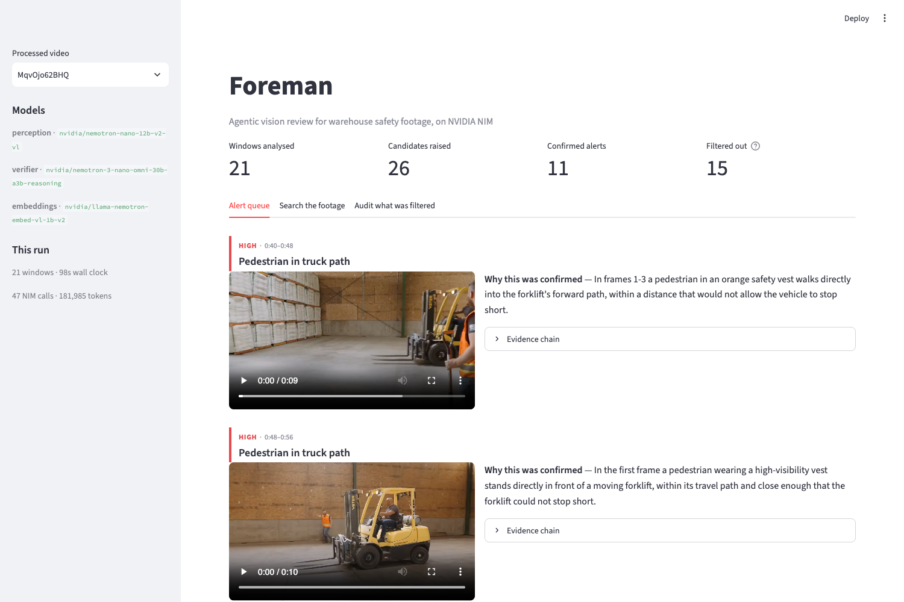
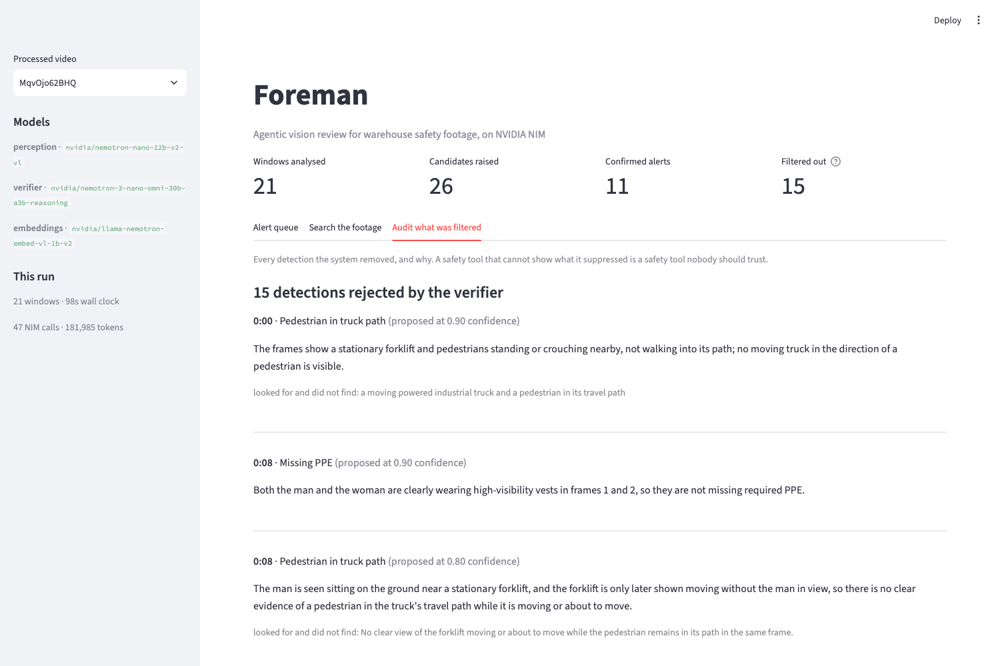
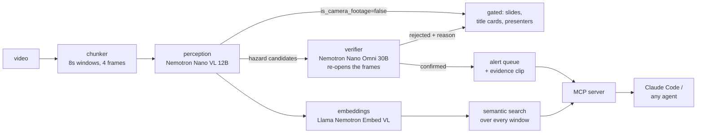

# Foreman

**Agentic vision AI for warehouse safety review, built on NVIDIA NIM.**

Point it at warehouse footage and it returns a short queue of verified safety alerts,
each one carrying the evidence it was confirmed on and the standard it maps to, plus a
searchable index of everything else it saw. It runs on NVIDIA-hosted NIM endpoints, so
it reproduces on a laptop with an API key and no GPU.



---

## The problem this is actually solving

Ask a vision language model "is there a safety hazard in this footage" and it will
almost always say yes. On the labelled set in this repo, a single-pass VLM flags a
hazard in **77% of windows that contain none**. That is not a system a safety
supervisor will use twice, and no amount of prompt rewriting fixes it, because the
prompt is not the problem. Showing a model a safety camera and asking about hazards
hands it an overwhelming prior that hazards are present.

Foreman treats that as an architecture problem rather than a wording problem. The
perception pass is allowed to over-report, and a **second model that can only remove
things** re-opens the same frames and decides whether the evidence actually meets the
bar for the class that was claimed.

Measured on 49 hand-labelled windows:

| arm | precision | recall | F1 | windows falsely alerting |
|---|---|---|---|---|
| `vlm_only` — every candidate becomes an alert | 0.15 | 0.80 | 0.25 | 30/39 (77%) |
| `vlm_conf_80` — keep candidates above 0.80 confidence | 0.18 | 0.80 | 0.30 | 28/39 (72%) |
| `llm_verifier` — reasoning LLM reviews the perception *text* | 0.14 | 0.30 | 0.19 | 12/39 (31%) |
| **`vlm_verifier` — reasoning VLM re-opens the *frames*** | **0.35** | **0.60** | **0.44** | **10/39 (26%)** |

Over three repeats the verifier arm runs P=0.34 [0.31–0.38], R=0.50 [0.40–0.60],
F1=0.40 [0.36–0.46]. **Precision roughly doubles; recall pays for it.** Full numbers,
including a per-class false-positive breakdown, are in
[`evals/RESULTS.md`](evals/RESULTS.md). Reproduce with `python evals/run_eval.py`.

### Three findings worth more than the headline number

**1. Confidence thresholds barely work.** Going from every candidate to only those the
model rated 0.80+ moved precision 0.15 → 0.18. A VLM's self-reported confidence is
close to useless as a filter here: it is confident about the things it is wrong about.

**2. Text-only verification is worse than no verification.** The `llm_verifier` arm
reads the perception pass's written evidence and adjudicates on that. It collapses to
F1 0.19 — *below the naive baseline*. The written evidence is too thin to clear the
bar the verifier is applying, so it rejects nearly everything, real hazards included.
The verifier has to look at the pixels. This one surprised me and it is the reason the
architecture has a VLM in the second position rather than a cheaper LLM.

**3. VLMs read on-screen text as though it were the world.** The first window of the
first video is a title card: black screen, white words, "PASSING IN FRONT OF A
FORKLIFT". The perception model reported a pedestrian walking in front of a moving
forklift at 0.95 confidence. The verifier confirmed it as high severity. Both models
had turned printed words into an observed event.

Real deployments are full of this — burned-in timestamps, camera labels, training
overlays. The fix is a **scene gate**: the perception pass declares whether it is
looking at real camera footage at all, in the same call, at no extra cost. It removes
an entire class of confident nonsense and is worth +0.07 precision on top of the
verifier (`vlm_verifier` 0.35 vs `vlm_verifier_nogate` 0.28).



Every suppressed detection stays visible and auditable. A safety tool that cannot show
what it threw away is one nobody should trust.

---

## Architecture



| stage | model | why this one |
|---|---|---|
| perception | `nvidia/nemotron-nano-12b-v2-vl` | smallest model that reliably holds the JSON contract across every chunk; ~2s per window |
| verification | `nvidia/nemotron-3-nano-omni-30b-a3b-reasoning` | reasoning VLM, different family and size from the proposer, so a confirmation is a genuine second look rather than a model agreeing with itself |
| search | `nvidia/llama-nemotron-embed-vl-1b-v2` | vision-language retriever, so queries land in the space the perception pass described |

**On Cosmos.** `nvidia/cosmos-reason2-8b` is the natural perception model here — Cosmos
Reason is post-trained for physical-world spatial and temporal reasoning rather than
generic captioning, which is exactly the axis a hazard call turns on. It is not
provisioned on the free `build.nvidia.com` tier (account-scoped 404 as of Aug 2026), so
this runs on Nemotron VL. `VLM_PRIMARY` in [`src/foreman/nim.py`](src/foreman/nim.py)
is one line; swap it on a self-hosted NIM and the eval harness will report the
comparison honestly instead of my asserting it.

### Design decisions I would defend in review

**8-second windows, 4 sampled frames.** Shorter and the model cannot see motion, so a
pedestrian standing still and a pedestrian walking into a travel path look identical.
Longer and an alert cannot be localised to a moment a reviewer can act on.

**The taxonomy is upstream of the model.** [`hazards.py`](src/foreman/hazards.py)
defines five classes from OSHA 29 CFR 1910.178 and the struck-by categories that
dominate warehouse injury data — chosen from what an inspector needs, not from what a
VLM happens to describe well. The perception prompt, the verifier's reject criteria,
the label schema and the UI filters all read from that one definition, so a class
cannot drift between the model proposing it and the harness grading it.

**The proposer and the adjudicator get different information.** The verifier sees each
class's known false positive; the perception pass does not. Telling the proposer what
not to say suppresses real detections along with phantom ones. Telling the adjudicator
what to watch for raises precision without touching recall.

**Tools are shaped like questions, not like the call graph.**
[`mcp_server.py`](src/foreman/mcp_server.py) exposes `search_timeline`, `list_alerts`,
`explain_alert`, `list_rejected_detections`, `shift_summary`, `hazard_taxonomy` —
the questions a supervisor actually asks. Agent surfaces that mirror internal module
boundaries are how they become unusable.

---

## Quickstart

```bash
git clone https://github.com/YashNirwan/foreman && cd foreman
python3 -m venv .venv && ./.venv/bin/pip install -e .
cp .env.example .env      # add a free key from https://build.nvidia.com

python scripts/fetch_data.py                          # pull sample footage locally
./.venv/bin/python -m foreman.pipeline data/raw_yt/MqvOjo62BHQ.mp4
./.venv/bin/streamlit run app.py                      # review console
```

Requires `ffmpeg` and `yt-dlp` on PATH (`brew install ffmpeg yt-dlp`).

A 172-second video: 21 windows, 26 candidates, 11 confirmed alerts, **98 seconds wall
clock** on a laptop against the free tier, 47 NIM calls.

### Drive it from an agent

```bash
claude mcp add foreman -- /abs/path/to/foreman/.venv/bin/python -m foreman.mcp_server
```

Then ask in plain language: *"what were the high-severity alerts in that shift, and
show me what the verifier threw out."*

### Reproduce the eval

```bash
python evals/run_eval.py --perceive   # perception + all 7 arms
python evals/variance.py --repeats 3  # run-to-run spread on the headline arms
```

---

## What this is not

Honest limits, because a work sample that oversells is worse than one that is small:

- **The eval is small.** 49 windows, 10 positive events, one annotator (me). Class
  balance is skewed — 7 of 10 positives are `pedestrian_in_path`, and `blocked_egress`
  has no positive examples at all, so its numbers mean nothing yet. Treat the
  precision figures as a directional result on one labelled set, not a benchmark.
- **Recall drops meaningfully.** 0.80 → 0.50. On a real floor you would tune the
  verifier's bar per class, and you would almost certainly accept lower precision on
  `pedestrian_in_path` than on `missing_ppe`, because the cost of missing them differs.
- **Labels are judgement calls.** The guideline is written at the top of
  [`ground_truth.json`](evals/ground_truth.json)'s generator and ambiguous windows are
  labelled negative. A second annotator would move these numbers.
- **Sampled frames are not video.** Four frames across eight seconds miss fast events.
  The production answer is a CV pipeline (DeepStream, or the tracking stage in the
  Metropolis VSS blueprint) triggering VLM review on clips it has already localised,
  rather than a VLM scanning uniformly.
- **No post-training.** Everything here is prompted and orchestrated, not fine-tuned.
  The obvious next step is distilling the verifier's confirmed/rejected decisions into
  a small VLM and checking whether it holds precision at a fraction of the cost.
- **Not a substitute for a trained safety professional**, and the eval footage is
  training material rather than live operational CCTV.

## Where this goes at scale

The shape here is deliberately the shape of NVIDIA's
[VSS blueprint](https://github.com/NVIDIA-AI-Blueprints/video-search-and-summarization):
ingest, VLM perception, retrieval over descriptions, verified alerts. Foreman is the
laptop-scale version, and each stage has a real replacement — flat numpy index → a
vector DB, uniform sampling → DeepStream-triggered clips, hosted NIM → self-hosted NIM
containers, single video → multi-stream. What survives the swap is the part I would
argue matters most and that the blueprint leaves to you: **the verification stage and
the eval harness that proves it earns its place.**

## Data and licensing

Code is MIT. **No video is redistributed in this repo.** The eval ships as labels and
derived model output keyed on chunk ids; `scripts/fetch_data.py` rebuilds the local
footage from public sources for analysis. See [DATA.md](DATA.md).

---

Built by [Yash Nirwan](https://yashnirwan.com) · [github.com/YashNirwan](https://github.com/YashNirwan)
